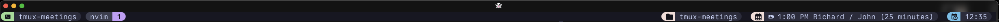

# Meetings plugin for tmux

Shows next meeting in the status line, data provided by [icalBuddy](https://hasseg.org/icalBuddy/)



## Installation
### Prerequisites

You need to have [icalBuddy](https://hasseg.org/icalBuddy/) installed.
You can download the zip'd binary from there or install via brew

```bash
brew install ical-buddy
```

### With Tmux Plugin Manager
Add the plugin in `.tmux.conf`:
```
set -g @plugin 'jrgirvan/tmux-meetings'
```
Press `prefix + I` to fetch the plugin and source it. Done.

### Manual
Clone the repo somewhere. Add `run-shell` in the end of `.tmux.conf`:

```
run-shell PATH_TO_REPO/meetings.tmux
```
NOTE: this line should be placed after `set-option -g status-right ...`.

Press `prefix + :` and type `source-file ~/.tmux.conf`. Done.

## Usage
Add `#{meetings}` somewhere in the right status line:
```
set-option -g status-right "#{meetings}"
```
then you will see your next meeting in the status line: `󰤙 14:00 - 1:1 Manager`

## Customization
The plugin could be customized with:
* `set-option -g @tmux-meetings-calendars "your.email@addre.ss"` - Set up the email address to include, comma delimited
* `set-option -g @tmux-meetings-alert-minutes 15` - How long before the meeting to show in the status line
* `set-option -g @tmux-meetings-popup-seconds 10` - How long before the meeting to show a tmux popup
* `set-option -g @tmux-meetings-icon-free "󱁕 "`   - Icon to display when free
* `set-option -g @tmux-meetings-icon-meeting "󰤙"` - Icon to display for a meeting

## [catppuccin/tmux](https://github.com/catppuccin/tmux)

You can add this as a [status line module](https://github.com/catppuccin/tmux/blob/main/docs/tutorials/02-custom-status.md)

```tmux
# file: ~/.config/tmux/meetings.conf

# vim:set ft=tmux:
# Requires https://github.com/jrgirvan/tmux-meetings.
%hidden MODULE_NAME="meetings"

set -ogq @catppuccin_${MODULE_NAME}_icon " "
set -ogqF @catppuccin_${MODULE_NAME}_color "#{E:@thm_blue}"
set -ogq "@catppuccin_${MODULE_NAME}_text" " #(#{TMUX_PLUGIN_MANAGER_PATH}/tmux-meetings/meetings.tmux)"

source -F "#{TMUX_PLUGIN_MANAGER_PATH}/tmux/utils/status_module.conf"
```

```tmux
# file: ~/.config/tmux/tmux.conf

# ...
run '#{TMUX_PLUGIN_MANAGER_PATH}tmux/catppuccin.tmux'
source -F "#{d:current_file}/meetings.conf"
# ...

```

## License

tmux-meetings plugin is released under the [MIT License](https://opensource.org/licenses/MIT).
